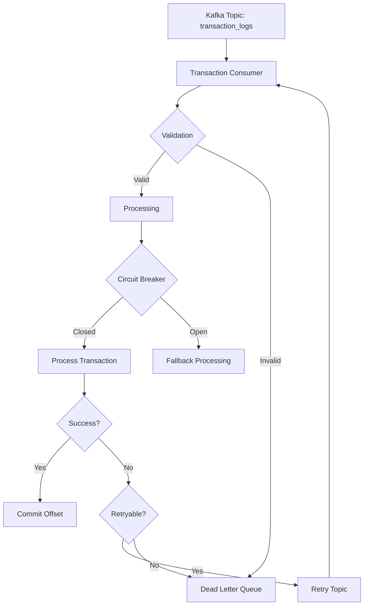
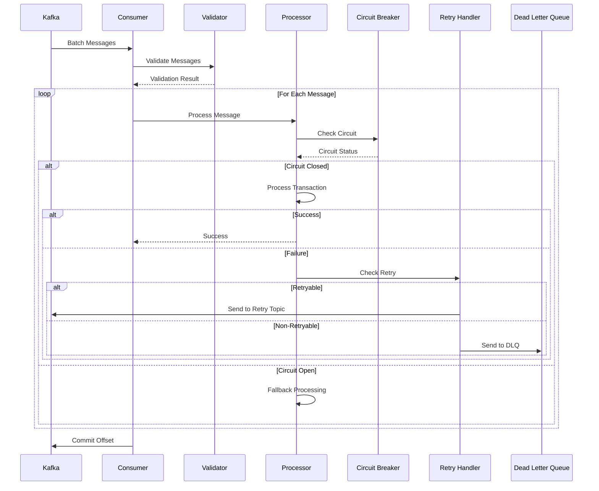
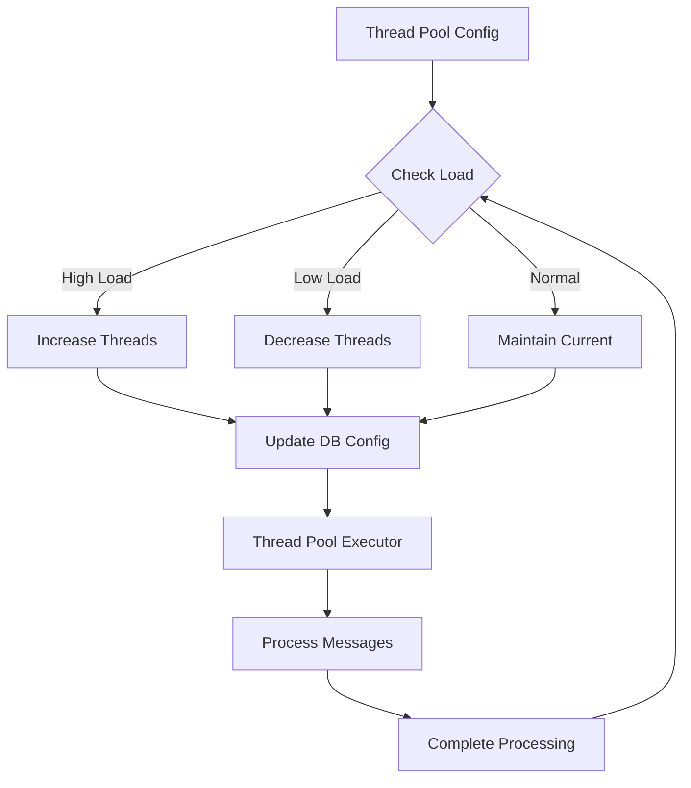
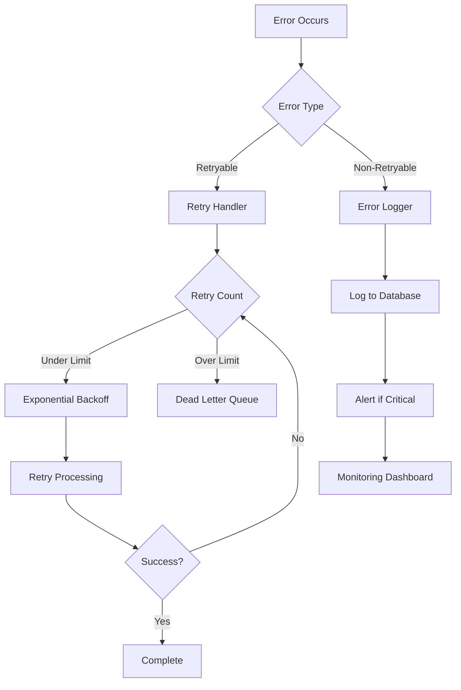
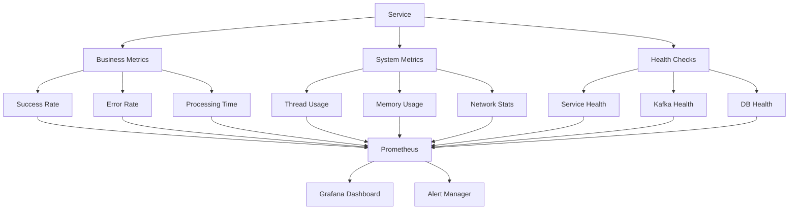
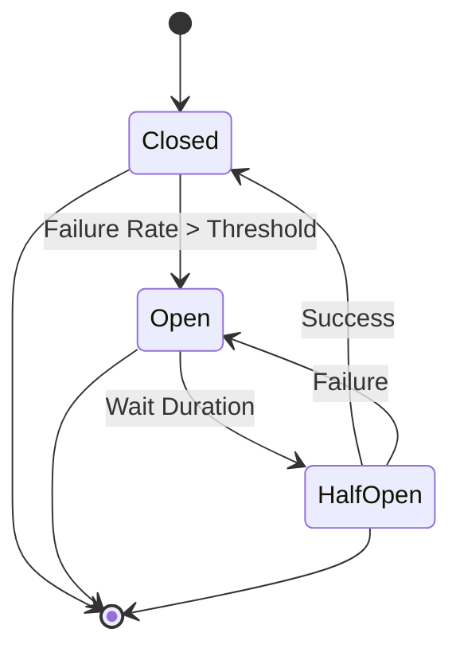
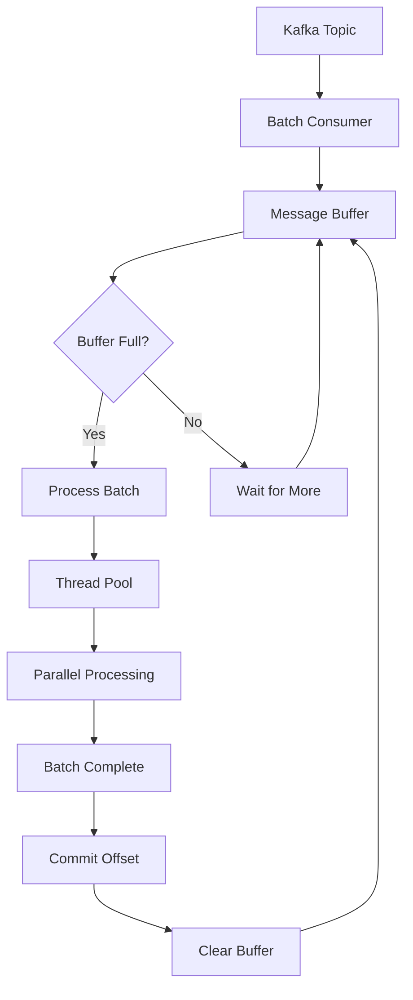
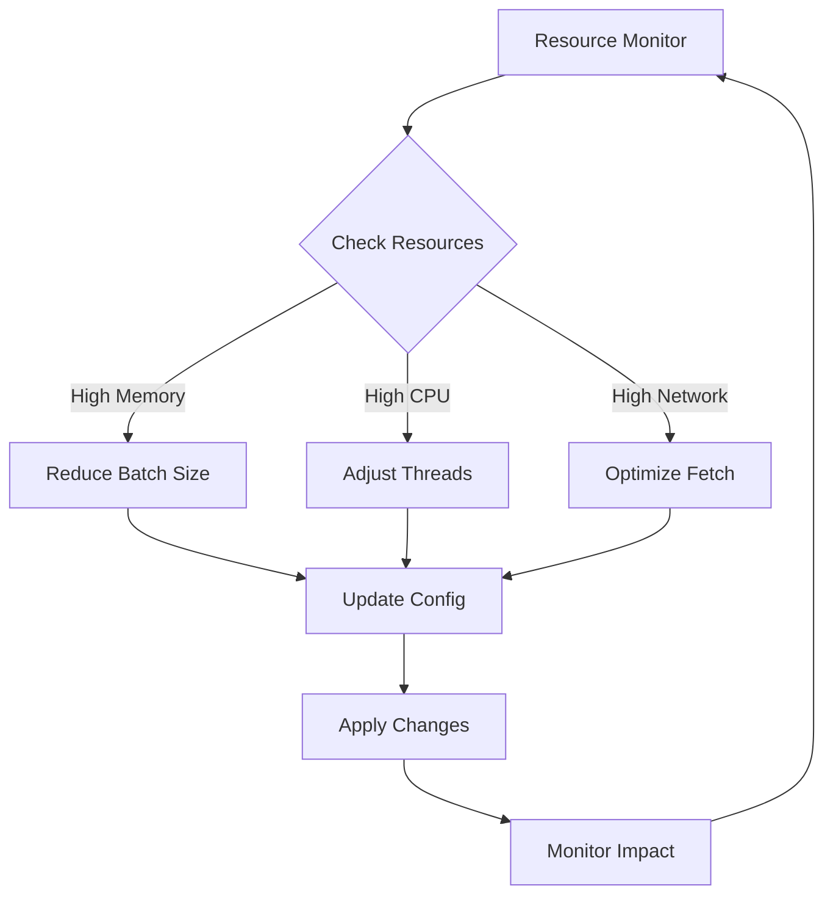

# Transaction Consumer Service - Business Flow Diagrams

## 1. Tổng Quan Luồng Xử Lý

## 2. Chi Tiết Xử Lý Message

## 3. Thread Pool Management

## 4. Error Handling Flow

## 5. Monitoring và Metrics Flow

## 6. Circuit Breaker States

## 7. Batch Processing Flow

## 8. Resource Management

## Chú Thích

1. **Tổng Quan Luồng Xử Lý**:
   - Hiển thị luồng chính của service từ khi nhận message đến khi xử lý xong
   - Bao gồm các điểm quyết định chính và xử lý lỗi

2. **Chi Tiết Xử Lý Message**:
   - Sequence diagram chi tiết về cách xử lý từng message
   - Hiển thị tương tác giữa các component

3. **Thread Pool Management**:
   - Flow của việc quản lý thread pool
   - Cách điều chỉnh số lượng thread dựa trên tải

4. **Error Handling Flow**:
   - Chi tiết về cách xử lý các loại lỗi khác nhau
   - Flow của retry mechanism và dead letter queue

5. **Monitoring và Metrics**:
   - Các loại metrics được thu thập
   - Flow của dữ liệu monitoring

6. **Circuit Breaker States**:
   - Các trạng thái của circuit breaker
   - Điều kiện chuyển đổi giữa các trạng thái

7. **Batch Processing Flow**:
   - Chi tiết về cách xử lý batch
   - Flow của buffer và commit

8. **Resource Management**:
   - Cách quản lý và tối ưu tài nguyên
   - Flow của việc điều chỉnh cấu hình 